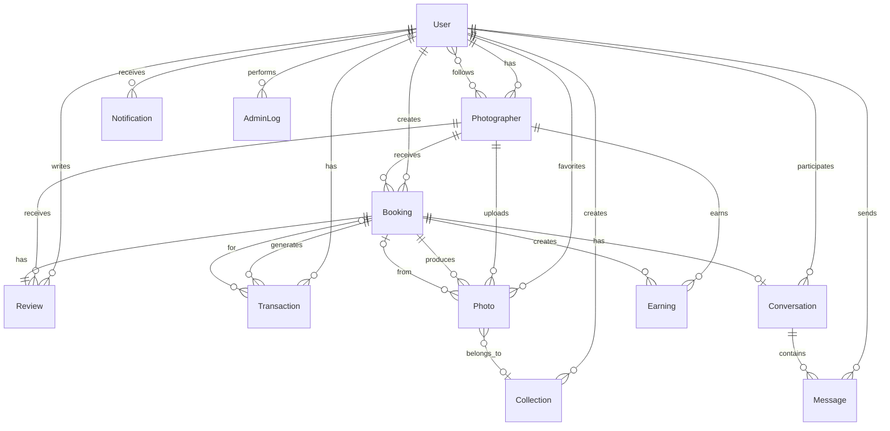

# Lumira Database ERD (Entity Relationship Diagram)

## Overview
This document describes the database schema for the Lumira photography platform, including all entities, their attributes, and relationships.

## Database: MongoDB (Mongoose ODM)

---

## Entity Relationship Diagram

---

## Entities and Attributes

### 1. User
**Description:** Base user entity for all platform users (customers, photographers, admins)

| Field | Type | Required | Description |
|-------|------|----------|-------------|
| `_id` | ObjectId | Yes | Primary key |
| `name` | String | Yes | Full name |
| `firstName` | String | No | First name |
| `lastName` | String | No | Last name |
| `email` | String | Yes | Unique email address |
| `password` | String | Conditional | Hashed password (required if not Google OAuth) |
| `googleId` | String | No | Google OAuth ID (unique, sparse) |
| `phone` | String | No | Phone number |
| `role` | Enum | Yes | `photographer`, `customer`, `admin` (default: `customer`) |
| `specialties` | [String] | No | Photography specialties (for photographers) |
| `profilePicture` | String | No | Profile picture URL |
| `avatar` | String | No | Avatar URL |
| `location` | Object | No | Location details |
| `location.city` | String | No | City |
| `location.province` | String | No | Province (default: Quebec) |
| `location.country` | String | No | Country (default: Canada) |
| `refreshToken` | String | No | JWT refresh token |
| `resetPasswordToken` | String | No | Password reset token |
| `resetPasswordExpire` | Date | No | Password reset expiration |
| `isActive` | Boolean | No | Account active status (default: true) |
| `paymentMethods` | [Object] | No | Payment method details |
| `paymentMethods[].type` | Enum | No | `credit_card`, `debit_card`, `bank_account` |
| `paymentMethods[].stripePaymentMethodId` | String | No | Stripe payment method ID |
| `paymentMethods[].last4` | String | No | Last 4 digits |
| `paymentMethods[].expiryMonth` | Number | No | Expiry month |
| `paymentMethods[].expiryYear` | Number | No | Expiry year |
| `paymentMethods[].cardBrand` | String | No | Card brand |
| `paymentMethods[].isDefault` | Boolean | No | Default payment method |
| `paymentMethods[].isVerified` | Boolean | No | Verification status |
| `settings` | Object | No | User preferences |
| `settings.emailNotifications` | Boolean | No | Email notifications enabled |
| `settings.messageNotifications` | Boolean | No | Message notifications enabled |
| `settings.promotionalEmails` | Boolean | No | Promotional emails enabled |
| `settings.pushNotifications` | Boolean | No | Push notifications enabled |
| `settings.publicProfile` | Boolean | No | Public profile visibility |
| `settings.showLocation` | Boolean | No | Show location in profile |
| `settings.showBookingHistory` | Boolean | No | Show booking history |
| `createdAt` | Date | Auto | Creation timestamp |
| `updatedAt` | Date | Auto | Last update timestamp |

**Indexes:**
- `email` (unique)
- `googleId` (unique, sparse)

**Relationships:**
- One-to-One: `Photographer` (if role is photographer)
- One-to-Many: `Booking` (as client)
- One-to-Many: `Review` (as customer)
- One-to-Many: `Transaction`
- One-to-Many: `Notification`
- One-to-Many: `Collection`
- Many-to-Many: `Conversation` (through participants)
- One-to-Many: `Message` (as sender)
- One-to-Many: `AdminLog` (as admin)
- Many-to-Many: `Photo` (through favorites)

---

### 2. Photographer
**Description:** Extended profile for photographers with business details

| Field | Type | Required | Description |
|-------|------|----------|-------------|
| `_id` | ObjectId | Yes | Primary key |
| `user` | ObjectId | Yes | Reference to User (unique) |
| `bio` | String | No | Biography (max 1000 chars) |
| `location` | Object | No | Business location |
| `location.city` | String | No | City |
| `location.province` | String | No | Province (default: Quebec) |
| `location.address` | String | No | Street address |
| `specialties` | [String] | Yes | Photography specialties (min 1) |
| `portfolio` | [ObjectId] | No | Array of Photo references |
| `coverPhoto` | String | No | Cover photo URL |
| `profilePhoto` | String | No | Profile photo URL |
| `rating` | Number | No | Average rating (0-5, default: 0) |
| `totalReviews` | Number | No | Total review count (default: 0) |
| `totalBookings` | Number | No | Total bookings count (default: 0) |
| `totalEarnings` | Number | No | Total earnings (default: 0) |
| `followers` | [ObjectId] | No | Array of User references (followers) |
| `following` | [ObjectId] | No | Array of User references (following) |
| `availability` | Object | No | Availability settings |
| `availability.workingHours` | Object | No | Weekly schedule |
| `availability.workingHours[day]` | Object | No | Day-specific hours |
| `availability.workingHours[day].start` | String | No | Start time |
| `availability.workingHours[day].end` | String | No | End time |
| `availability.workingHours[day].available` | Boolean | No | Available flag |
| `availability.blockedDates` | [Object] | No | Blocked dates |
| `availability.blockedDates[].date` | Date | No | Blocked date |
| `availability.blockedDates[].reason` | String | No | Reason for blocking |
| `availability.timeZone` | String | No | Timezone (default: America/Montreal) |
| `pricing` | Object | No | Pricing structure |
| `pricing.basePrice` | Number | No | Base price (min: 0) |
| `pricing.hourlyRate` | Number | No | Hourly rate (min: 0) |
| `pricing.packages` | [Object] | No | Package offerings |
| `pricing.packages[].name` | String | No | Package name |
| `pricing.packages[].duration` | Number | No | Duration in hours |
| `pricing.packages[].price` | Number | No | Package price |
| `pricing.packages[].description` | String | No | Package description |
| `pricing.currency` | String | No | Currency (default: CAD) |
| `isVerified` | Boolean | No | Verification status (default: false) |
| `isActive` | Boolean | No | Active status (default: true) |
| `featured` | Boolean | No | Featured photographer (default: false) |
| `createdAt` | Date | Auto | Creation timestamp |
| `updatedAt` | Date | Auto | Last update timestamp |

**Indexes:**
- `user` (unique)
- Text index: `location.city`, `location.province`, `specialties`, `bio`
- `rating` (descending)
- `totalBookings` (descending)
- `createdAt` (descending)

**Virtual Fields:**
- `followerCount` - Returns count of followers

**Relationships:**
- One-to-One: `User`
- One-to-Many: `Booking` (as photographer)
- One-to-Many: `Review` (as photographer)
- One-to-Many: `Photo`
- One-to-Many: `Earning`
- Many-to-Many: `User` (through followers/following)

---

### 3. Booking
**Description:** Booking/appointment between customer and photographer

| Field | Type | Required | Description |
|-------|------|----------|-------------|
| `_id` | ObjectId | Yes | Primary key |
| `client` | ObjectId | Yes | Reference to User (customer) |
| `photographer` | ObjectId | Yes | Reference to Photographer |
| `date` | Date | Yes | Booking date |
| `startTime` | String | Yes | Start time |
| `duration` | Number | Yes | Duration in hours (min: 1) |
| `location` | String | Yes | Location address |
| `notes` | String | No | Additional notes (max 500 chars) |
| `status` | Enum | Yes | `pending`, `confirmed`, `cancelled`, `completed`, `declined` (default: `pending`) |
| `pricing` | Object | Yes | Pricing breakdown |
| `pricing.basePrice` | Number | Yes | Base price (min: 0) |
| `pricing.hourlyRate` | Number | No | Hourly rate (min: 0) |
| `pricing.durationHours` | Number | Yes | Duration in hours (min: 1) |
| `pricing.subtotal` | Number | Yes | Subtotal (calculated) |
| `pricing.commission` | Number | Yes | Platform commission (calculated) |
| `pricing.commissionPercentage` | Number | No | Commission % (default: 9) |
| `pricing.commissionFixed` | Number | No | Fixed commission (default: 2) |
| `pricing.total` | Number | Yes | Total amount (calculated) |
| `pricing.photographerEarnings` | Number | Yes | Photographer earnings (calculated) |
| `payment` | Object | No | Payment details |
| `payment.status` | Enum | No | `pending`, `paid`, `refunded`, `failed` |
| `payment.paymentMethod` | String | No | Payment method |
| `payment.transactionId` | String | No | Transaction ID |
| `payment.paidAt` | Date | No | Payment timestamp |
| `payment.refundedAt` | Date | No | Refund timestamp |
| `payment.refundAmount` | Number | No | Refund amount |
| `payment.refundReason` | String | No | Refund reason |
| `photos` | [ObjectId] | No | Array of Photo references |
| `review` | ObjectId | No | Reference to Review (one per booking) |
| `cancelledBy` | Enum | No | `client`, `photographer`, `admin` |
| `cancellationReason` | String | No | Cancellation reason |
| `cancelledAt` | Date | No | Cancellation timestamp |
| `completedAt` | Date | No | Completion timestamp |
| `createdAt` | Date | Auto | Creation timestamp |
| `updatedAt` | Date | Auto | Last update timestamp |

**Indexes:**
- `client` + `createdAt` (descending)
- `photographer` + `createdAt` (descending)
- `status` + `date`
- `date`

**Relationships:**
- Many-to-One: `User` (as client)
- Many-to-One: `Photographer`
- One-to-One: `Review`
- One-to-Many: `Photo`
- One-to-Many: `Transaction`
- One-to-One: `Earning`
- One-to-One: `Conversation` (optional)

**Business Logic:**
- Pricing is auto-calculated: `subtotal = basePrice + (hourlyRate * duration)`
- Commission: `commission = (subtotal * 9%) + $2`
- Total: `total = subtotal + commission`
- Photographer earnings: `photographerEarnings = subtotal - commission`

---

### 4. Photo
**Description:** Photo/image uploaded by photographers

| Field | Type | Required | Description |
|-------|------|----------|-------------|
| `_id` | ObjectId | Yes | Primary key |
| `photographer` | ObjectId | Yes | Reference to Photographer |
| `title` | String | No | Photo title (max 200 chars) |
| `description` | String | No | Description (max 1000 chars) |
| `imageUrl` | String | Yes | Image URL |
| `thumbnailUrl` | String | No | Thumbnail URL |
| `category` | String | No | Category |
| `tags` | [String] | No | Tags array |
| `location` | Object | No | Photo location |
| `location.city` | String | No | City |
| `location.province` | String | No | Province |
| `equipment` | Object | No | Equipment details |
| `equipment.camera` | String | No | Camera model |
| `equipment.lens` | String | No | Lens model |
| `equipment.settings` | String | No | Camera settings |
| `favorites` | [ObjectId] | No | Array of User references (users who favorited) |
| `likes` | Number | No | Like count (default: 0) |
| `views` | Number | No | View count (default: 0) |
| `isPortfolio` | Boolean | No | Portfolio photo flag (default: true) |
| `isPublic` | Boolean | No | Public visibility (default: true) |
| `collection` | ObjectId | No | Reference to Collection |
| `booking` | ObjectId | No | Reference to Booking (if from booking) |
| `metadata` | Object | No | Image metadata |
| `metadata.width` | Number | No | Image width |
| `metadata.height` | Number | No | Image height |
| `metadata.fileSize` | Number | No | File size in bytes |
| `metadata.format` | String | No | File format (jpeg, png, raw, etc.) |
| `metadata.uploadedAt` | Date | No | Upload timestamp |
| `createdAt` | Date | Auto | Creation timestamp |
| `updatedAt` | Date | Auto | Last update timestamp |

**Indexes:**
- `photographer` + `createdAt` (descending)
- `isPublic` + `createdAt` (descending)
- `category`
- `tags`
- `location.city` + `location.province`

**Virtual Fields:**
- `favoriteCount` - Returns count of users who favorited

**Relationships:**
- Many-to-One: `Photographer`
- Many-to-One: `Collection` (optional)
- Many-to-One: `Booking` (optional)
- Many-to-Many: `User` (through favorites)

---

### 5. Review
**Description:** Customer reviews for photographers

| Field | Type | Required | Description |
|-------|------|----------|-------------|
| `_id` | ObjectId | Yes | Primary key |
| `booking` | ObjectId | Yes | Reference to Booking (unique) |
| `photographer` | ObjectId | Yes | Reference to Photographer |
| `customer` | ObjectId | Yes | Reference to User (customer) |
| `rating` | Number | Yes | Overall rating (1-5) |
| `title` | String | No | Review title (max 200 chars) |
| `comment` | String | Yes | Review text (max 1000 chars) |
| `categories` | Object | No | Category ratings |
| `categories.professionalism` | Number | No | Rating (1-5) |
| `categories.communication` | Number | No | Rating (1-5) |
| `categories.quality` | Number | No | Rating (1-5) |
| `categories.punctuality` | Number | No | Rating (1-5) |
| `isVerified` | Boolean | No | Verified review (default: false) |
| `isPublic` | Boolean | No | Public visibility (default: true) |
| `createdAt` | Date | Auto | Creation timestamp |
| `updatedAt` | Date | Auto | Last update timestamp |

**Indexes:**
- `booking` (unique) - One review per booking
- `photographer` + `createdAt` (descending)
- `customer` + `createdAt` (descending)

**Relationships:**
- One-to-One: `Booking`
- Many-to-One: `Photographer`
- Many-to-One: `User` (as customer)

**Business Logic:**
- Automatically updates photographer's `rating` and `totalReviews` when saved/deleted
- Rating calculation: Average of all public reviews

---

### 6. Transaction
**Description:** Financial transactions (payments, refunds, payouts)

| Field | Type | Required | Description |
|-------|------|----------|-------------|
| `_id` | ObjectId | Yes | Primary key |
| `user` | ObjectId | Yes | Reference to User |
| `type` | Enum | Yes | `charge`, `refund`, `payout`, `commission` |
| `amount` | Number | Yes | Transaction amount |
| `currency` | String | No | Currency (default: CAD) |
| `status` | Enum | Yes | `pending`, `processing`, `completed`, `failed`, `cancelled` |
| `description` | String | Yes | Transaction description |
| `booking` | ObjectId | No | Reference to Booking |
| `paymentMethod` | String | No | Payment method |
| `transactionId` | String | No | External transaction ID (e.g., Stripe) |
| `metadata` | Map | No | Additional metadata |
| `createdAt` | Date | Auto | Creation timestamp |
| `updatedAt` | Date | Auto | Last update timestamp |

**Indexes:**
- `user` + `createdAt` (descending)
- `type` + `status`
- `transactionId`

**Relationships:**
- Many-to-One: `User`
- Many-to-One: `Booking` (optional)

---

### 7. Earning
**Description:** Photographer earnings from completed bookings

| Field | Type | Required | Description |
|-------|------|----------|-------------|
| `_id` | ObjectId | Yes | Primary key |
| `photographer` | ObjectId | Yes | Reference to Photographer |
| `booking` | ObjectId | Yes | Reference to Booking (unique) |
| `month` | Number | Yes | Month (1-12) |
| `year` | Number | Yes | Year |
| `totalAmount` | Number | Yes | Total booking amount (min: 0) |
| `commission` | Number | Yes | Platform commission (min: 0) |
| `earnings` | Number | Yes | Photographer earnings (min: 0) |
| `payoutStatus` | Enum | Yes | `pending`, `processing`, `paid`, `failed` |
| `payoutDate` | Date | No | Payout date |
| `payoutId` | String | No | Payout transaction ID |
| `createdAt` | Date | Auto | Creation timestamp |
| `updatedAt` | Date | Auto | Last update timestamp |

**Indexes:**
- `photographer` + `year` (descending) + `month` (descending)
- `booking` (unique) - One earning per booking
- `payoutStatus`

**Relationships:**
- Many-to-One: `Photographer`
- One-to-One: `Booking`

---

### 8. Notification
**Description:** User notifications

| Field | Type | Required | Description |
|-------|------|----------|-------------|
| `_id` | ObjectId | Yes | Primary key |
| `user` | ObjectId | Yes | Reference to User |
| `type` | Enum | Yes | Notification type |
| `title` | String | Yes | Notification title |
| `message` | String | Yes | Notification message |
| `actionUrl` | String | No | URL for action |
| `isRead` | Boolean | No | Read status (default: false) |
| `readAt` | Date | No | Read timestamp |
| `metadata` | Map | No | Additional metadata |
| `createdAt` | Date | Auto | Creation timestamp |
| `updatedAt` | Date | Auto | Last update timestamp |

**Notification Types:**
- `booking_request`
- `booking_accepted`
- `booking_declined`
- `booking_cancelled`
- `booking_completed`
- `message`
- `review`
- `payment`
- `system`

**Indexes:**
- `user` + `createdAt` (descending)
- `user` + `isRead`
- `type`

**Relationships:**
- Many-to-One: `User`

---

### 9. Collection
**Description:** User-created photo collections

| Field | Type | Required | Description |
|-------|------|----------|-------------|
| `_id` | ObjectId | Yes | Primary key |
| `user` | ObjectId | Yes | Reference to User |
| `name` | String | Yes | Collection name (max 100 chars) |
| `description` | String | No | Description (max 500 chars) |
| `photos` | [ObjectId] | No | Array of Photo references |
| `coverPhoto` | ObjectId | No | Reference to Photo (cover) |
| `isPublic` | Boolean | No | Public visibility (default: false) |
| `createdAt` | Date | Auto | Creation timestamp |
| `updatedAt` | Date | Auto | Last update timestamp |

**Indexes:**
- `user` + `createdAt` (descending)
- Text index: `name`, `description`

**Virtual Fields:**
- `photoCount` - Returns count of photos

**Relationships:**
- Many-to-One: `User`
- One-to-Many: `Photo`

---

### 10. Conversation
**Description:** Chat conversations between users

| Field | Type | Required | Description |
|-------|------|----------|-------------|
| `_id` | ObjectId | Yes | Primary key |
| `participants` | [ObjectId] | Yes | Array of User references (min 2) |
| `booking` | ObjectId | No | Reference to Booking (optional) |
| `lastMessage` | ObjectId | No | Reference to Message |
| `lastMessageAt` | Date | No | Last message timestamp (default: now) |
| `unreadCount` | Map | No | Unread count per user |
| `createdAt` | Date | Auto | Creation timestamp |
| `updatedAt` | Date | Auto | Last update timestamp |

**Indexes:**
- `participants`
- `lastMessageAt` (descending)
- `booking`

**Relationships:**
- Many-to-Many: `User` (through participants)
- One-to-One: `Booking` (optional)
- One-to-Many: `Message`

---

### 11. Message
**Description:** Individual messages in conversations

| Field | Type | Required | Description |
|-------|------|----------|-------------|
| `_id` | ObjectId | Yes | Primary key |
| `conversation` | ObjectId | Yes | Reference to Conversation |
| `sender` | ObjectId | Yes | Reference to User |
| `text` | String | Yes | Message text (max 5000 chars) |
| `status` | Enum | Yes | `sent`, `delivered`, `read` (default: `sent`) |
| `readAt` | Date | No | Read timestamp |
| `attachments` | [Object] | No | Message attachments |
| `attachments[].type` | Enum | No | `image`, `file`, `link` |
| `attachments[].url` | String | No | Attachment URL |
| `attachments[].filename` | String | No | Filename |
| `attachments[].size` | Number | No | File size |
| `createdAt` | Date | Auto | Creation timestamp |
| `updatedAt` | Date | Auto | Last update timestamp |

**Indexes:**
- `conversation` + `createdAt` (descending)
- `sender`
- `status`

**Relationships:**
- Many-to-One: `Conversation`
- Many-to-One: `User` (as sender)

---

### 12. AdminLog
**Description:** Admin action logs for audit trail

| Field | Type | Required | Description |
|-------|------|----------|-------------|
| `_id` | ObjectId | Yes | Primary key |
| `admin` | ObjectId | Yes | Reference to User (admin) |
| `action` | Enum | Yes | Action type |
| `entityType` | Enum | Yes | `user`, `booking`, `payment`, `system` |
| `entityId` | ObjectId | Yes | Entity ID |
| `reason` | String | No | Action reason |
| `metadata` | Map | No | Additional metadata |
| `createdAt` | Date | Auto | Creation timestamp |
| `updatedAt` | Date | Auto | Last update timestamp |

**Action Types:**
- `user_suspended`
- `user_activated`
- `user_deleted`
- `booking_refunded`
- `payment_processed`
- `system_config_updated`

**Indexes:**
- `admin` + `createdAt` (descending)
- `action`
- `entityType` + `entityId`

**Relationships:**
- Many-to-One: `User` (as admin)

---

## Key Relationships Summary

### One-to-One Relationships
- `User` ↔ `Photographer` (if user is photographer)
- `Booking` ↔ `Review` (one review per booking)
- `Booking` ↔ `Earning` (one earning per booking)
- `Booking` ↔ `Conversation` (optional)

### One-to-Many Relationships
- `User` → `Booking` (as client)
- `User` → `Review` (as customer)
- `User` → `Transaction`
- `User` → `Notification`
- `User` → `Collection`
- `User` → `Message` (as sender)
- `User` → `AdminLog` (as admin)
- `Photographer` → `Booking` (as photographer)
- `Photographer` → `Review` (as photographer)
- `Photographer` → `Photo`
- `Photographer` → `Earning`
- `Booking` → `Photo`
- `Booking` → `Transaction`
- `Collection` → `Photo`
- `Conversation` → `Message`

### Many-to-Many Relationships
- `User` ↔ `User` (through Photographer.followers/following)
- `User` ↔ `Photo` (through Photo.favorites)
- `User` ↔ `Conversation` (through Conversation.participants)

---

## Business Rules

1. **User Registration:**
   - Email must be unique
   - Password required unless using Google OAuth
   - Default role is `customer`

2. **Photographer Profile:**
   - One photographer profile per user
   - Must have at least one specialty
   - Rating automatically calculated from reviews

3. **Bookings:**
   - One review per booking
   - Pricing auto-calculated on save
   - Commission: 9% + $2 fixed fee
   - Status flow: `pending` → `confirmed` → `completed`

4. **Reviews:**
   - Can only be created after booking is completed
   - Automatically updates photographer rating
   - One review per booking (enforced by unique index)

5. **Earnings:**
   - Created when booking is completed
   - One earning record per booking
   - Tracks monthly earnings for payouts

6. **Photos:**
   - Can belong to portfolio, collection, or booking
   - Public photos visible in explore/search
   - Favorites tracked per user

7. **Messages:**
   - Messages belong to conversations
   - Conversations can be linked to bookings
   - Unread counts tracked per user

---

## Indexes Summary

### Performance Indexes
- User email (unique)
- Photographer search (text index)
- Booking queries (client/photographer + date)
- Photo queries (photographer + public status)
- Review queries (photographer + customer)
- Transaction queries (user + date)
- Notification queries (user + read status)
- Message queries (conversation + date)

### Unique Constraints
- User email
- User googleId (sparse)
- Photographer user (one-to-one)
- Booking review (one-to-one)
- Booking earning (one-to-one)

---

## Data Flow Examples

### Booking Flow
1. Customer creates booking → `Booking` created with status `pending`
2. Photographer accepts → Status changes to `confirmed`
3. Payment processed → `Transaction` created, `Booking.payment.status` = `paid`
4. Booking completed → Status changes to `completed`, `Earning` created
5. Customer writes review → `Review` created, `Photographer.rating` updated

### Photo Upload Flow
1. Photographer uploads photo → `Photo` created
2. Photo added to portfolio → `Photographer.portfolio` updated
3. Photo added to collection → `Collection.photos` updated
4. User favorites photo → `Photo.favorites` updated

### Messaging Flow
1. Users start conversation → `Conversation` created with participants
2. User sends message → `Message` created, `Conversation.lastMessage` updated
3. Message read → `Message.status` = `read`, `Conversation.unreadCount` updated

---

## Notes

- All timestamps use MongoDB's automatic `createdAt` and `updatedAt`
- Soft deletes can be implemented using `isActive` flags
- Text search uses MongoDB text indexes
- Financial calculations are handled in pre-save hooks
- Rating calculations are handled in post-save hooks
- All ObjectId references use Mongoose population for queries
